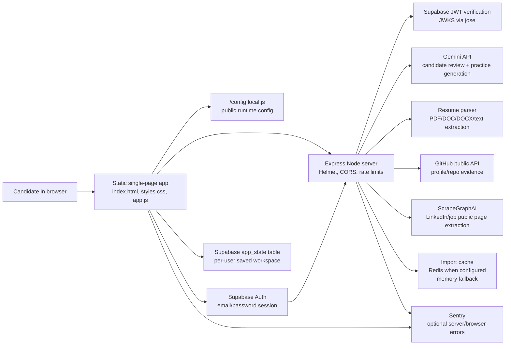

# Interview Prep Studio

A protected browser app for turning pasted resume text and user notes into a concise candidate brief, interview prep plan, and tailored resume draft. Generated outputs come from the Gemini API through the Node backend.

## System design



The browser keeps the working session responsive and sends only protected API requests for live AI, imports, and resume parsing. The Node server validates request shape with Zod, verifies Supabase JWTs before protected actions, keeps secret API keys in `.env`, and returns normalized JSON for the UI. Supabase stores each user's saved workspace state with row-level security, while Redis is an optional cache for repeated public imports.

## Gemini AI setup

1. Open Google AI Studio.
2. Create an API key for the Gemini API.
3. Copy `.env.example` to `.env` if you have not already.
4. Put the key in `.env`:

```bash
GEMINI_API_KEY=your_key_here
GEMINI_MODEL=gemini-2.5-flash
SGAI_API_KEY=your_scrapegraphai_key_here
```

Do not put Gemini or ScrapeGraphAI keys in `app.js`, `index.html`, or `config.local.js`. API keys belong only in `.env`, which is ignored by git.

## Supabase Auth setup

1. Create or open a Supabase project.
2. In Authentication > Sign In / Providers, enable Email.
3. In Authentication > URL Configuration, add your local and deployed app URLs to the redirect allow list. For local testing with the command below, add `http://127.0.0.1:8001`.
4. In Project Settings > API, copy the Project URL and publishable key.
5. Copy `.env.example` to `.env` and `config.local.example.js` to `config.local.js`.
6. Put your local Supabase values in `.env` and `config.local.js`.
7. Run [supabase/migrations/20260503000000_app_state.sql](/Users/reneefong/Desktop/codex-hackathon/supabase/migrations/20260503000000_app_state.sql) in the Supabase SQL Editor, or apply it with your Supabase CLI, to create the saved app state table.

Use the publishable key only. Do not place a service role or secret key in browser code.

The `app_state` table stores each signed-in user's resume, notes, profile/job context, generated AI output, tailored draft, and prep memory. Row Level Security is enabled so authenticated users can only read and write their own row.

## Sentry setup

Sentry is optional. The backend uses `SENTRY_DSN` from `.env`, and the browser uses `window.SENTRY_CONFIG` from `config.local.js`.

1. Create a Sentry JavaScript project.
2. Copy the project DSN.
3. Add backend settings to `.env`:

```bash
SENTRY_DSN=your_sentry_dsn_here
SENTRY_ENVIRONMENT=development
SENTRY_RELEASE=interview-prep-studio@local
SENTRY_TRACES_SAMPLE_RATE=0
```

4. Add browser settings to `config.local.js`:

```js
window.SENTRY_CONFIG = {
  browserDsn: "your_sentry_dsn_here",
  environment: "development",
  release: "interview-prep-studio@local",
  tracesSampleRate: 0,
};
```

The app scrubs `authorization` and `cookie` headers before sending events and does not attach the signed-in user's email to browser Sentry events.
The backend preload file [instrument.mjs](/Users/reneefong/Desktop/codex-hackathon/instrument.mjs) must run before `server.js`; the `npm start` and `npm run dev` scripts already do this with Node's `--import` flag.

## Use

Start the Node server and open the app:

```bash
npm start
```

Then visit `http://127.0.0.1:8001`.

Keep `window.APP_CONFIG.apiBaseUrl` empty in `config.local.js` for local development. The browser will call the same host and port that served the app, which avoids mismatches when you run on `8888`, `8010`, or another port.

Normal page-load request logs are quiet by default. Set `HTTP_ACCESS_LOGS=true` in `.env` if you want verbose request logging while debugging.

External imports are tuned for faster local testing. The defaults cache repeated ScrapeGraphAI URL imports for 15 minutes, use one scroll, and cap slow imports at 35 seconds. Adjust `SGAI_TIMEOUT_MS`, `SGAI_WAIT_MS`, `SGAI_SCROLLS`, `SGAI_CACHE_TTL_MS`, or `GEMINI_INPUT_MAX_CHARS` in `.env` if you need deeper extraction or larger AI context.

Set `REDIS_URL=redis://127.0.0.1:6379` if you want the ScrapeGraphAI import cache shared across server restarts or multiple Node processes. If Redis is not configured or cannot be reached, the app falls back to an in-memory cache.

The app supports:

- Unauthenticated sample workspace for quick demos
- Supabase email/password sign up and sign in
- Protected workspace routes that require an active session
- Sign out
- Resume and notes text areas
- Workspace readiness checklist for resume, target role, evidence, and generated prep completeness
- LinkedIn profile URL field
- Open LinkedIn button for faster copy/paste workflow
- ScrapeGraphAI LinkedIn import for public profile data
- Pasted LinkedIn profile text as a fallback
- GitHub profile or repository URL import for public project metadata
- GitHub project text for tailored resume project highlights
- Job posting URL field, including LinkedIn job URLs
- Open job posting button for faster copy/paste workflow
- ScrapeGraphAI job posting import for public job pages
- Pasted job description text as a fallback
- Resume imports for `.pdf`, `.doc`, `.docx`, `.txt`, `.md`, `.csv`, and `.rtf`
- Notes imports for `.txt`, `.md`, `.csv`, and `.rtf`
- Sample data for a quick demo
- Gemini AI generation through `/api/generate`
- Strengths, gaps, and next action generation
- Local role keyword coverage showing matched and missing job signals from the supplied evidence
- LeetCode-style practice question plan
- System design prompt generation
- Interview question bank for coding, system design, and behavioral questions with practiced tracking
- Language-specific DSA practice generator with C++, Python, JavaScript, TypeScript, Java, and Go starter templates
- Common language internals interview questions for C++, Python, JavaScript, TypeScript, Java, and Go
- Local STAR story builder that turns resume/generated evidence into Situation, Task, Action, Result prompts
- Application tracker for company, role, URL, status, stage, priority, deadlines, date applied, follow-up date, recruiter, and notes
- Editable candidate brief with copy support
- Editable tailored resume draft with copy support
- One-click interview prep pack export as copied text or Markdown download
- Supabase persistence for intake fields, imported context, generated output, edited drafts, and prep memory
- Autosave status, autosave opt-out, and clear saved workspace data control

Gemini calls run through `server.js` so the API key is not exposed to browser JavaScript. Auth sessions are managed by Supabase.

LinkedIn profile and job URLs can be imported through backend ScrapeGraphAI routes when `SGAI_API_KEY` is configured. Only public data should be imported. Private or login-only profile/job data is not supported.

GitHub URLs can be imported when they point to public profiles or repositories. The browser calls the protected backend `/api/github/extract` route, and the server uses GitHub's public API to pull repo descriptions, topics, languages, stars, and README excerpts for single repositories. Set `GITHUB_TOKEN` in `.env` if you want a higher GitHub API rate limit; leave it empty for unauthenticated public API access.

The sample workspace is intentionally local. It opens the app, loads sample candidate data, and generates deterministic sample output without calling Gemini or writing to Supabase. Sign in to use live AI generation, resume parsing, ScrapeGraphAI imports, GitHub imports, and cloud autosave.
